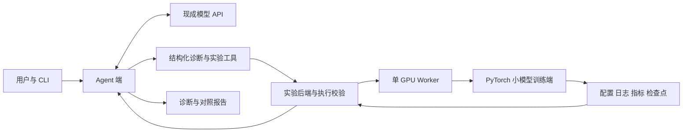

# TrainPilot

轻量语言模型训练实验与诊断 Agent。项目通过小模型训练、性能测量和受约束的工具调用，探索训练算法、AI Infra 与 Agent 工程。

GitHub 仓库：[CHT-1026/TrainPilot](https://github.com/CHT-1026/TrainPilot)。本地已配置 origin；首次推送尚未完成，需要可用的 GitHub 身份认证。

**当前状态：方案与 Git 管理已建立，训练端、实验后端和 Agent 尚未实现。没有已测得的性能提升或模型效果数据。**

## 阅读入口

- [项目产品与实施方案](docs/product-plan.md)：产品场景、技术栈、两端分工、实施顺序与验收标准。
- [Word 展示文档](docs/TrainPilot项目产品与实施方案.docx)：由同一份 Markdown 源生成；当前环境缺少文档渲染器，实际分页与视觉排版尚待核验。
- [Git 开发与 GitHub 展示规范](docs/git-workflow.md)：提交、分支、远程同步和成果展示。
- [学习与实施路线](docs/roadmap.md)：相对启动日的关键节点和可勾选任务。
- [开源来源与贡献边界](THIRD_PARTY_NOTICES.md)：区分 MiniMind 原有能力与项目自研工作。
- [变更记录](CHANGELOG.md)。

## 计划架构

训练的小模型是实验对象；Agent 的分析与工具选择由现成模型 API 支持。实验后端负责预算、参数、路径和运行时约束。

## 第一版计划

| 模块 | 工作 | 状态 |
| --- | --- | --- |
| 训练端 | 小规模预训练与 SFT、固定验证集、性能指标 | 待实现 |
| 实验后端 | 配置校验、单 GPU 串行任务、状态与结果保存 | 待实现 |
| Agent 端 | 工具调用、证据分析、短实验验证、停止条件 | 待实现 |
| 评测 | 性能对比、训练效果与诊断案例集 | 待实现 |

## 本地查看

目前可以直接阅读 docs 下的方案。应用尚无可运行入口，不提供虚构的安装或启动命令。

文档生成脚本为 `scripts/build_project_doc.py`，依赖 `python-docx`。它仅生成文档，不安装应用依赖、不调用模型 API、不租用 GPU。

## 预算与成果

总预算上限为 500 元。先测量短实验耗时，再确定训练 token 数与租赁时长。实际结果将在完成实验后记录到 reports，包含配置、代码提交 SHA、硬件信息与指标口径。

## 开源使用

计划参考 [MiniMind](https://github.com/jingyaogong/minimind)。当前未复制其代码；引入时固定上游提交并保留原许可证。TrainPilot 自研代码的许可证待仓库所有者选择。
