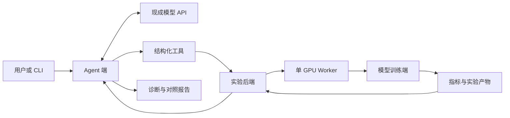

# TrainPilot 项目产品与实施方案

版本 v0.1  日期 2026年10月6日  状态 规划阶段

## 项目定位与使用场景

TrainPilot 面向需要理解和排查小模型训练问题的开发者，提供训练实验、性能测量和诊断 Agent。项目以可复现的小规模语言模型为对象，让开发者从训练日志发现问题，提出原因，再通过短实验验证改进。面试展示重点是自主实现、测量过程与结果依据。

当前已完成方案与仓库基础管理。训练端、实验后端、Agent 和评测尚未实现；文中的接口、时间与指标均为设计或验收建议，不代表已上线能力。

项目作者熟悉 Python、C++、Linux 和后端开发，使用过 PyTorch 与 Docker，尚未独立编写训练循环。实施路线先建立训练基础，再学习性能分析与 Agent 工程。第一版同时包含训练和 Agent，总预算不超过 500 元。

### 用户任务

典型输入是“这次训练很慢，检查原因并验证改进”。系统读取配置和指标，选择检查工具，提出诊断假设，提交有限规模的对照实验，再返回证据、结果与适用条件。证据不足时补充测量，无法验证时明确保留不确定性。

训练的小模型是被分析的实验对象。Agent 使用现成模型 API 进行推理和工具选择，不要求刚训练的小模型承担诊断任务。

### 第一版范围

第一版采用单 GPU、小数据、少量诊断类型和命令行演示。包含小规模预训练与 SFT、性能指标、串行实验执行、Agent 工具调用和案例评测。多卡通信优化、CUDA 算子、大型前端、RAG 知识库与强化学习训练作为后续扩展。

成功标准是完成一组真实训练、一组可复现性能对照和一个 Agent 验证闭环。模型生成样例辅助展示训练过程，不能单独证明模型质量或项目效果。

<!-- pagebreak -->

## 系统架构与技术栈

系统划分为 Agent 端、实验后端和模型训练端。Agent 分析证据并选择工具；后端校验配置、排队和记录状态；训练端执行 PyTorch 程序并生成原始结果。该边界允许先独立学习训练，再用稳定接口接入 Agent。

### Agent 端选型

| 技术 | 用途 | 选型理由 |
| --- | --- | --- |
| Python 与 LangGraph | 组织检查、诊断、验证和报告步骤 | 显式状态与条件分支便于追踪多步任务 |
| 现成模型 API | 理解任务、提出假设、选择工具 | 将诊断能力与小模型训练效果分开 |
| Pydantic 与 HTTPX | 工具参数校验与接口调用 | 结构化输入输出，支持超时和错误处理 |
| JSONL 调用轨迹 | 记录工具输入、输出、费用和停止原因 | 支持回放、评测与错误定位 |

### 模型训练端选型

| 技术 | 用途 | 选型理由 |
| --- | --- | --- |
| PyTorch 与 MiniMind | 小模型结构、预训练和 SFT 基线 | 代码可阅读，训练规模可按预算缩小 |
| Transformers Tokenizer | 文本编码与训练数据对齐 | 与参考模型的数据格式衔接 |
| torch.profiler 与 CUDA Events | 性能采样与 GPU 时间测量 | 提供算子、内存和阶段耗时证据 |
| Matplotlib | 损失曲线和实验对比图 | 生成可放入仓库的静态图表 |

实验后端采用 FastAPI、Pydantic、SQLite 和 Python 子进程 Worker；共享 uv、Git、pytest、Linux 与 Docker。Python 3.11 是建议起点，实际依赖在 GPU 冒烟运行通过后锁定，不直接追随最新版本。模型供应商、GPU 型号和上游 SHA 尚待选择。

<!-- pagebreak -->

## 模型训练端设计与学习顺序

训练端接收已经校验的实验配置，输出模型检查点、训练与验证指标、环境信息和可选性能 trace。它不调用诊断模型 API，也不决定下一轮实验。

### 从最小训练循环开始

先理解 token、标签右移、因果 Attention 和交叉熵，再自己写出取 batch、前向、反向、梯度裁剪、优化器更新和保存的最小循环。用参考实现核对张量形状和损失行为，学习结果不能只停留在执行训练命令。

随后固定 MiniMind 上游版本，用限定数据和 token 预算完成预训练与 SFT。SFT 要检查回答 token 的损失掩码，避免把 padding 或不应训练的内容计入损失。第一版不追求完整复现上游模型效果。

### 数据与实验记录

数据先划分训练集与验证集，再做处理与训练；去重检查跨划分的相似样本。记录来源、许可、文件指纹、划分种子和 tokenizer 版本，验证集保持固定。每次运行绑定 run_id、配置指纹、项目 SHA 和上游 SHA。

### 算法与系统实验

| 实验 | 控制条件 | 要回答的问题 |
| --- | --- | --- |
| 学习率对比 | 同一数据划分、模型、有效 batch 和 token 预算 | 损失是否稳定，验证效果怎样变化 |
| 数据加载改进 | 相同训练任务与计时口径 | 取数据是否是瓶颈，改进是否有效 |
| 保存频率对比 | 相同训练 token 预算，分别记录保存开销 | 保存开销与可恢复进度怎样取舍 |

测量数据等待、搬运、计算、保存和验证阶段。考虑 GPU 异步执行，按需要使用 CUDA Events 或边界同步；性能采样与常规计时分开，避免 Profiler 开销污染吞吐。

优化根据实测瓶颈选择。梯度累积、混合精度、torch.compile 等已存在于参考项目，开启选项本身不能列为原创算法。自主贡献应体现在定位、实现差异、公平比较和效果分析。

恢复功能先做中断与连续运行的对照，检查优化器、随机数、数据顺序和进度。按发现的问题修复，不能仅凭能加载权重就宣称恢复一致。

<!-- pagebreak -->

## Agent 端设计与工具边界

Agent 根据任务和工具返回的证据形成假设，用短实验检查假设，再决定报告、补充检查或停止。第一版采用单 Agent；规则执行与资源控制由后端负责。

### 工作流程

任务接收后，先查询原实验状态和配置；读取指标并选择检查工具；给出候选原因和可证伪的验证方案；校验配置与额度后提交短实验；比较结果并生成报告。每一步记录来源、工具结果和停止原因。

| 工具 | 输入与输出 | 作用 |
| --- | --- | --- |
| get_run | run_id → 配置、状态与环境 | 建立诊断上下文 |
| summarize_metrics | run_id → 阶段耗时、吞吐与显存 | 提供结构化统计 |
| inspect_trace | artifact_id → 性能采样摘要 | 补充算子与时间证据 |
| validate_config | 实验配置 → 校验结果与估算范围 | 检查任务是否可执行 |
| submit_probe | 合法配置与幂等键 → 新 run_id | 提交有限规模验证 |
| compare_runs | 两个 run_id → 差异与可比性 | 检查改善和训练效果代价 |

原始 trace 由工具在本地处理成摘要，不直接把大文件交给模型。工具错误返回明确错误码，Agent 可修正参数或停止；后端对失败请求保持可追踪记录。

### 诊断范围与停止条件

第一版覆盖数据加载变慢、显存不足和保存过于频繁三类问题。记录真实注入方式与原因，用未在开发中使用的案例评测。只凭“GPU 利用率低”不直接判断唯一根因；需要结合阶段指标和验证结果。

建议将每个任务限制为最多 8 次模型调用和 1 次 GPU 验证实验，探针运行上限初设 5 分钟，试跑后调整。达到调用、费用、时间上限或证据不足时停止并说明未解决部分。

模型只提交结构化工具参数，不生成任意 shell 命令执行。报告包含诊断假设、证据引用、实验改动、结果、适用条件与仍不确定的内容。API 凭证从环境读取，调用轨迹提交前脱敏。

<!-- pagebreak -->

## 实验后端接口与部署方案

实验后端隔离模型建议和实际 GPU 执行。第一版一个 Worker 串行消费任务，SQLite 持久化状态，本地目录保存实验产物。先将队列状态与任务重启行为做正确，再考虑增加分布式队列。

### 接口与状态

| 接口草案 | 功能 |
| --- | --- |
| POST /runs | 校验并创建实验，返回 run_id |
| GET /runs/{run_id} | 查询配置、状态、错误和环境 |
| GET /runs/{run_id}/metrics | 获取统一指标摘要 |
| POST /runs/{run_id}/cancel | 请求终止并保存可用结果 |
| POST /diagnoses | 创建诊断任务 |
| GET /diagnoses/{id} | 获取调用轨迹与最终报告 |

运行状态包含 queued、running、succeeded、failed、cancelled 和 timed_out。创建请求携带幂等键，避免重试重复启动训练。重启后核对进程与数据库，不能直接把原 running 任务视为完成。

共享实验字段包括 stage、模型配置、dataset_id、seed、max_steps、max_wall_seconds、micro_batch_size、accumulation_steps、precision 和预算限制。结果包含 processed_tokens、supervised_tokens、wall_time、峰值 allocated 显存、验证损失和错误码。路径由 dataset_id 或 artifact_id 映射，接口不接受任意文件路径。

### 两种运行方式

本地回放模式使用小型脱敏夹具开发后端与 Agent，模型 API 仍可真实调用，不占用 GPU。真实实验模式在租赁 Linux 服务器部署训练 Worker 和后端，Agent 可在同机运行；采用 SSH 隧道访问接口，首版不要求公网常驻服务。

Docker 固定服务与工具环境，GPU 驱动兼容性另外核对。应用依赖通过 uv 管理，GPU PyTorch 的安装源和版本按租赁环境确认。先保存必要记录，再停止租赁实例；计算、存储和闲置费用分别记账。

### 预算分配与关键选择

GPU 上限 350 元，模型 API 上限 50 元，存储与其他上限 50 元，预留 50 元。这是内部预算分配，不是供应商报价。首轮短跑后按实测吞吐与实际价格计算剩余可训练 token 数。剩余额度不足时减少数据和实验次数，不提高总预算。

具体 GPU、供应商、API 模型和数据子集需在首次资源准备时确认；任何付费开通不属于本次文档工作。

<!-- pagebreak -->

## 实施阶段与关键时间节点

以实际启动日 D1 为起点，以下给出投入较充分时约四周的建议节奏。作者计划十一月求职但尚未指定日期，因此不用未经确认的日历截止时间。节点按验收成果推进，首次试跑后调整估算。

| 阶段 | 建议时间 | 关键成果与检查点 |
| --- | --- | --- |
| G0 环境准备 | D1—D2 | 固定上游与数据来源；CPU 冒烟和短 GPU 试跑；核对预算 |
| G1 训练基础 | D3—D7 | 最小训练循环；小规模预训练与 SFT；固定验证集和曲线 |
| G2 测量与改进 | D8—D12 | 阶段计时；Profiler 摘要；一组公平的性能对照 |
| G3 实验后端 | D13—D17 | 接口、串行 Worker、状态存储、超时和结果归档 |
| G4 Agent 接入 | D18—D23 | 结构化工具、诊断假设、验证实验、停止条件 |
| G5 评测与展示 | D24—D28 | 留出案例结果、失败分析、演示与 GitHub 阅读入口 |

### 必须先完成的依赖

训练基础是指标解释的前提；稳定的指标和执行接口是 Agent 的输入与工具契约。Agent 开发可以用夹具推进，但最后必须接真实实验。性能比较在更换模型、数据或训练任务后需要重新判断可比性。

G0 后决定训练规模；G1 后确认训练端正确性；G2 后冻结第一组改进报告；G4 后冻结 Agent 工具范围；G5 后才能填写简历中的实际结果并创建演示版本标签。

### 每阶段的学习主题

G1 学习张量与 autograd、Attention、交叉熵、优化器及 SFT 掩码。G2 学习 GPU 异步计时、显存口径、数据加载与性能采样。G3 学习任务状态、幂等、进程管理和持久化。G4 学习工具调用、上下文组织、条件路由和评测。学习围绕当阶段可运行任务展开。

### 范围缩减顺序

时间紧张时先取消前端和多卡扩展，保留 CLI；再减少诊断类型和探针次数；仍需保留训练、一次真实改进对照及一个 Agent 验证闭环。未完成的能力继续写为待实现，简历只描述已经有代码和证据的工作。

每天记录一个可验证进展，代码完成后立即提交对应修改；每个阶段末更新 roadmap 与报告，避免在最后一次提交中堆入全部成果。

<!-- pagebreak -->

## 验收指标与面试展示

评测同时覆盖训练正确性、运行效率和 Agent 诊断。以下是测量设计，不预设提升百分比或通过率。原始测量、配置和失败案例与结论一起保留。

| 维度 | 指标口径 | 验收证据 |
| --- | --- | --- |
| 训练效果 | 固定 tokenizer 与验证集的 token 加权损失 | 预训练、SFT 与算法对照曲线 |
| 训练吞吐 | 非 padding 的处理 tokens / 明确计时区间 | 分开记录端到端与纯训练区间 |
| 训练资源 | 峰值 allocated 显存，另记 reserved 显存 | 同硬件、同配置测量 |
| 性能对照 | 预热后步骤耗时及多次运行统计 | 至少三次短重复，注明噪声和代价 |
| 恢复行为 | 中断续训与连续运行的参数、步数和损失差异 | 实际对照及容差说明 |
| Agent 诊断 | 留出案例中证据支持的正确诊断数 / 案例数 | 按问题类型报告与人工复核 |
| Agent 执行 | 合法工具调用、任务完成率、调用费用和次数 | 脱敏轨迹与错误归因 |

SFT 另外记录真正参与损失的 supervised_tokens。FP32 与低精度的差异需结合训练效果解释；改变序列长度或样本处理量时，不能仅按每秒速度宣称同任务优化。

### 诊断评测设计

建议准备 15 个开发案例和 15 个留出案例，三类问题均衡覆盖。明确区分合成日志回放与真实故障实验，留出案例不参与提示调整。以静态规则、仅日志问答和带工具 Agent 为对照，检查工具验证是否带来额外价值。多原因或证据不足案例单独报告。

### 五分钟演示顺序

先说明任务与三端分工，展示真实训练曲线和原实验记录；提出一个已知故障任务，让 Agent 查询指标、提交短探针并比较结果；展示一个证据不足或失败恢复案例；最后打开报告、提交历史和开源来源。真实长实验可用事先保存的记录演示，并清楚标注回放。

### 面试官应能追问的问题

为什么这样计时，吞吐分母包含哪些阶段；如何控制对比条件；Agent 为什么选择该工具；预算或工具失败时如何处理；哪些能力来自 MiniMind；哪次优化没成功；数据、训练状态与模型损失之间有什么关系。每个回答尽量指向代码或实际记录。

<!-- pagebreak -->

## Git 管理与仓库成果组织

仓库以 Markdown 保存权威方案，Word 由脚本生成。README 是面试官入口，说明当前状态、架构、复现路径和真实结果。先记录规划，随后用小步提交呈现从训练基线到诊断闭环的演进。

### 目录与职责

| 路径 | 内容 |
| --- | --- |
| docs/ | 产品方案、实施路线和 Git 工作方式 |
| src/trainpilot/agent/ | 计划中的 Agent 与工具适配 |
| src/trainpilot/training/ | 计划中的训练封装与测量 |
| src/trainpilot/backend/ | 计划中的实验接口与 Worker |
| configs/ 与 tests/ | 待实现的合法配置与关键行为验证 |
| reports/ 与 examples/ | 实测报告和可公开的小型演示数据 |

代码目录按实现阶段创建，不以空文件伪装功能完成。数据、检查点、原始 trace、数据库与真实密钥不提交；报告通过指纹和独立存储位置关联大文件。

### 提交与版本

默认分支 main。使用 docs、feat、fix、perf 等提交类型，每次写清问题、改动和验证。模块开发可用 feat/training-baseline、feat/experiment-runner、feat/diagnostic-agent 分支。基线完成后才打 v0.1.0-baseline，演示闭环完成后才打 v0.2.0-demo。

每份报告绑定项目与上游 SHA、依赖版本、数据指纹、硬件、随机种子和费用。MiniMind 已有混合精度、梯度累积、日志和恢复等能力；本项目对复用、修改和自主实现分别说明。项目自身许可证和远程公开设置由作者确认。

### 资料入口

- [MiniMind 模型与训练参考](https://github.com/jingyaogong/minimind)
- [MiniMind 预训练实现](https://github.com/jingyaogong/minimind/blob/master/trainer/train_pretrain.py)
- [PyTorch Profiler 测量说明](https://docs.pytorch.org/tutorials/recipes/recipes/profiler_recipe.html)
- [LangGraph 状态与编排](https://docs.langchain.com/oss/python/langgraph/overview)
- [FastAPI 服务框架](https://fastapi.tiangolo.com/)
- [Pydantic 参数校验](https://docs.pydantic.dev/latest/)
- [uv 项目与依赖管理](https://docs.astral.sh/uv/guides/projects/)
- [GitHub Git 基础](https://docs.github.com/en/get-started/using-git/about-git)

技术能力描述依据上述官方文档。技术选型、接口、进度和验收门槛是本项目设计；实际运行结果在实验完成后补充。
